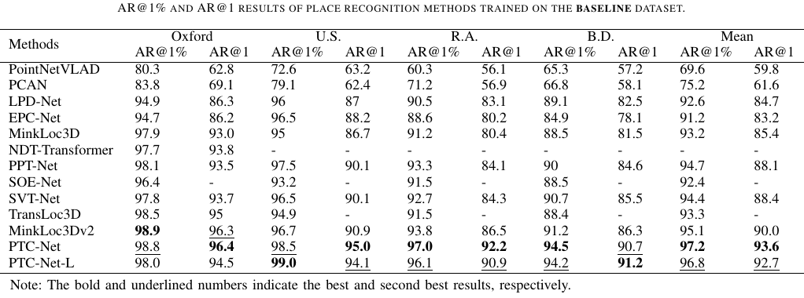
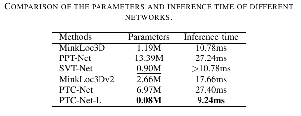

# [PTC-Net: Point-Wise Transformer with Sparse Convolution Network for Place Recognition](https://ieeexplore.ieee.org/document/10103149)

by  Lineng Chen,
    Huan Wang,
	Hui Kong,
	Wankou Yang,
	Mingwu Ren


### What's new ###
* [2023-04-25] Code is released. 

### Introduction
In the point-cloud-based place recognition area, the existing hybrid architectures combining both convolutional networks and transformers have shown promising performance. They mainly apply the voxel-wise transformer after the sparse convolution (SPConv). However, they can induce information loss by the sparse voxelization and further result in loss propagation to the transformer, significantly degrading the performance of the network, especially in outdoor scenes with complex geometric structures and multiple small objects. To address this issue, we propose a novel Point-wise Transformer with sparse Convolution (PTC). Specifically, SPConv is applied to the sparsely voxelized point cloud to extract local features, which are then converted to the point-based representation via a feature transformation unit (FTU). As such, our PTC can apply a transformer model based on the point-wise representation rather than on the voxel-wise one. To enhance the ability to capture long-range features and reduce the computational complexity of the transformer, we propose a two-step transformer, each with different grouping strategies. Meanwhile, in both steps, the attention matrix is computed with much fewer points by grouping a single point cloud into different attention domains. The experiments show that the PTC-Net can achieve state-of-the-art (SOTA) performance, with an improvement of 3.6\% on average recall@1. Furthermore, to demonstrate the effectiveness of the PTC, we introduce an extremely light-weight version, PTC-Net-L, with only one PTC layer and half initial channel dimensions, also achieving SOTA performance in terms of the average recall rate and running time with only 0.08M parameters.


## Main Results




### Datasets
* Oxford dataset
* NUS (in-house) Datasets
  * university sector (U.S.)
  * residential area (R.A.)
  * business district (B.D.)

Following [PointNetVLAD](https://arxiv.org/abs/1804.03492) the datasets can be downloaded [here](https://drive.google.com/open?id=1H9Ep76l8KkUpwILY-13owsEMbVCYTmyx).
Run the below code to generate pickles with positive and negative point clouds for each anchor point cloud. 

```generate pickles
cd generating_queries/ 

# Generate training tuples for the Baseline Dataset
python generate_training_tuples_baseline.py --dataset_root <dataset_root_path>

# Generate training tuples for the Refined Dataset
python generate_training_tuples_refine.py --dataset_root <dataset_root_path>

# Generate evaluation tuples
python generate_test_sets.py --dataset_root <dataset_root_path>
```
`<dataset_root_path>` is a path to dataset root folder, e.g. `/data/pointnetvlad/benchmark_datasets/`.
Before running the code, ensure you have read/write rights to `<dataset_root_path>`, as training and evaluation pickles
are saved there. 

### Environment and Dependencies
Our code was tested using Python 3.8.12 with PyTorch 1.10.2 and MinkowskiEngine 0.5.4 on Ubuntu 18.04 with CUDA 10.2.

The following Python packages are required:
* PyTorch (version 1.10.1)
* [MinkowskiEngine](https://github.com/NVIDIA/MinkowskiEngine) (version 0.5.4)
* pytorch_metric_learning (version 1.1 or above)
* pandas
* tqdm


### Training and Evaluation
Note that our training code refers to MinkLoc3Dv2. For more details of the training code please refer to [here](https://github.com/jac99/MinkLoc3Dv2).

* Modify the `PYTHONPATH` environment variable to include absolute path to the project root folder: 
    ```
    export PYTHONPATH=$PYTHONPATH:/home/.../PTC-Net-main
    ```

* build the pointops

  ```
  cd libs/pointops && python setup.py install && cd ../../
  ```
  
* Train the network

    ```
    cd training
    
    # To train model on the Baseline Dataset
    python train.py --config ../config/config_baseline.txt --model_config ../models/config_model.txt
    
    # To train model on the Refined Dataset
    python train.py --config ../config/config_refined.txt --model_config ../models/config_model.txt
    ```

* Evaluate the network

    ```eval baseline
    cd eval
    
    # To evaluate the model trained on the Baseline Dataset
    python pnv_evaluate.py --config ../config/config_baseline.txt --model_config ../models/config_model.txt --weights ../weights/*.pth
    
    # To evaluate the model trained on the Refined Dataset
    python pnv_evaluate.py --config ../config/config_refined.txt --model_config ../models/config_model.txt --weights ../weights/*.pth
    ```

### Citation

If you find this work useful, please consider citing:

    @ARTICLE{10103149,
      author={Lineng, Chen and Huan, Wang and Hui, Kong and Wankou, Yang and Mingwu Ren},
      journal={IEEE Robotics and Automation Letters}, 
      title={PTC-Net: Point-Wise Transformer With Sparse Convolution Network for Place Recognition}, 
      year={2023},
      volume={},
      number={},
      pages={1-8},
      doi={10.1109/LRA.2023.3267693}}

### License
Our code is released under the MIT License (see LICENSE file for details).

#### Acknowledgement

Our code refers to 
[PointNetVLAD](https://github.com/mikacuy/pointnetvlad), 
[MinkLoc3Dv2](https://github.com/jac99/MinkLoc3Dv2) 
and [PPT-Net](https://github.com/fpthink/PPT-Net).
